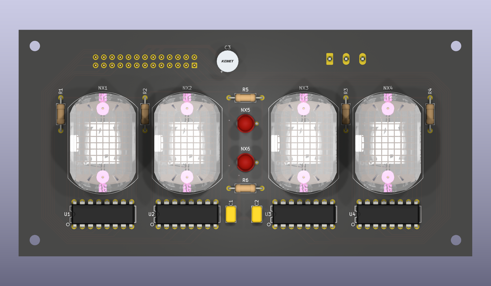
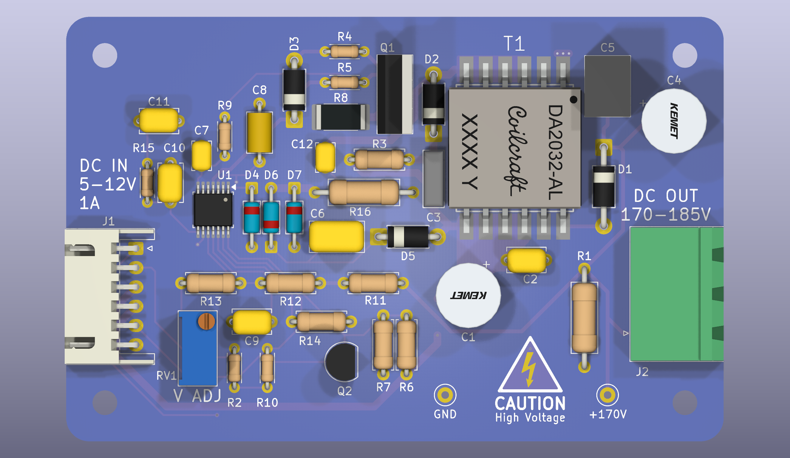

[![CC BY-SA 4.0][cc-by-sa-shield]][cc-by-sa]

# Nixie Clock

USB-C powered nixie tube clock. Four IN-12B digits, two IN-6 colon lamps, K155ID1 BCD decoder/drivers.

## Boards

### Clock Face

### 170V Flyback converter

## Power

USB-PD negotiates 5-12 V from the charger and gates it through a back-to-back PFET load switch.
Three converters hang off that rail:

- Flyback boost: 170V for the tube anodes
- 3.3V buck boost for the MCU. Boost exists to make sure a 3.3V FTDI type UART adapter provides the
  full 3.3V to the rail without back-driving the main bus.
- 5V buck for the BCD drivers, bypassed if the source itself is 5V

## Firmware note

Tube cathodes are not wired to the decoder outputs in numerical order. The layout connects each
cathode to whichever decoder output it reaches most directly. The K155ID1's output order around its
package does not match the IN-12B's cathode order around its pin circle, so wiring it that way is
more trouble than it's worth. Firmware therefore holds a mapping from BCD number to tube number.

## Repository layout

- `pcb/` KiCad projects. One project each for the clock face, high voltage flyback converter and the
  main board with the MCU, USB-PD, 3.3V and 5V converters.
- `pcb/lib/` project libraries; origins and local changes in [pcb/lib/README.md](pcb/lib/README.md)
- `docs/` design doc and vendor datasheets
- `scripts/` [make_release.py](scripts/make_release.py), fab exports with enforced revision bookkeeping

## Fab files

    python scripts/make_release.py --check
    python scripts/make_release.py

Writes JLCPCB-ready gerbers, BOM, and placement files under `fab/` and tags the commit. The script's
docstring explains the revision rules it enforces.

## Credits

The IN-12B and IN-6 symbols and footprints started as imports from
[judge2005's Eagle-and-KiCAD-Nixie-Libs](https://github.com/judge2005/Eagle-and-KiCAD-Nixie-Libs)
and were modified here. The IN-12B tube model comes from
[laurivosandi's nixiesp12](https://github.com/laurivosandi/nixiesp12), which credits miniwatt.info
as its origin. Full library inventory: [pcb/lib/README.md](pcb/lib/README.md).

## AI use

AI assistance is used to write and edit documentation, build symbols/footprints, and as a sounding
board for design work. All schematic drawing and PCB layout is done by hand.

## License

This work is licensed under a
[Creative Commons Attribution-ShareAlike 4.0 International License][cc-by-sa].

[![CC BY-SA 4.0][cc-by-sa-image]][cc-by-sa]

[cc-by-sa]: http://creativecommons.org/licenses/by-sa/4.0/
[cc-by-sa-image]: https://licensebuttons.net/l/by-sa/4.0/88x31.png
[cc-by-sa-shield]: https://img.shields.io/badge/License-CC%20BY--SA%204.0-lightgrey.svg
